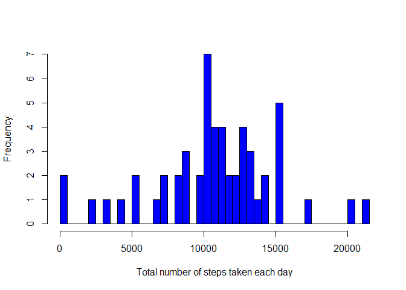
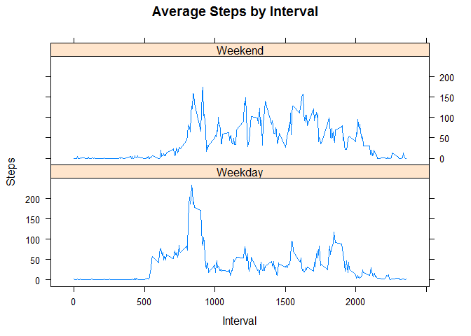

# Reproducible Research: Peer Assessment 1


## Loading and preprocessing the data

```r
unzip("activity.zip")
data <- read.csv("activity.csv", header=TRUE, sep=',')
head(data)
```

```
##   steps       date interval
## 1    NA 2012-10-01        0
## 2    NA 2012-10-01        5
## 3    NA 2012-10-01       10
## 4    NA 2012-10-01       15
## 5    NA 2012-10-01       20
## 6    NA 2012-10-01       25
```

1. Calculate the total number of steps taken per day

```r
DailyTotalSteps <- aggregate(steps ~ date, data, sum)
head(DailyTotalSteps)
```

```
##         date steps
## 1 2012-10-02   126
## 2 2012-10-03 11352
## 3 2012-10-04 12116
## 4 2012-10-05 13294
## 5 2012-10-06 15420
## 6 2012-10-07 11015
```

2. If you do not understand the difference between a histogram and a barplot, research the difference between them. Make a histogram of the total number of steps taken each day

## What is mean total number of steps taken per day?

```r
hist(DailyTotalSteps$steps, col="blue", breaks = 50, xlab = "Total number of steps taken each day", main="")
```

 

3. Calculate and report the mean and median of the total number of steps taken per day

### Mean total number of steps taken per day

```r
mean(DailyTotalSteps$steps)
```

```
## [1] 10766.19
```

### Median total number of steps taken per day

```r
median(DailyTotalSteps$steps)
```

```
## [1] 10765
```

## What is the average daily activity pattern?
1. Make a time series plot (i.e. type = "l") of the 5-minute interval (x-axis) and the average number of steps taken, averaged across all days (y-axis)

```r
IntervalAvgSteps <- aggregate(steps ~ interval, data[!is.na(data$steps),], mean)
head(IntervalAvgSteps)
```

```
##   interval     steps
## 1        0 1.7169811
## 2        5 0.3396226
## 3       10 0.1320755
## 4       15 0.1509434
## 5       20 0.0754717
## 6       25 2.0943396
```

```r
plot(IntervalAvgSteps$interval, IntervalAvgSteps$steps, type="l", xlab="Interval", ylab="Average Steps")
```

 

2. Which 5-minute interval, on average across all the days in the dataset, contains the maximum number of steps?

```r
IntervalAvgSteps$interval[IntervalAvgSteps$steps==max(IntervalAvgSteps$steps)]
```

```
## [1] 835
```

## Imputing missing values

1. Calculate and report the total number of missing values in the dataset (i.e. the total number of rows with NAs)

```r
length(data$steps[is.na(data$steps)])
```

```
## [1] 2304
```

2. Devise a strategy for filling in all of the missing values in the dataset. The strategy does not need to be sophisticated. For example, you could use the mean/median for that day, or the mean for that 5-minute interval, etc.

Replace the missing values with the mean of that 5-minute interval.

3. Create a new dataset that is equal to the original dataset but with the missing data filled in.

```r
newdata <- transform(data, steps = ifelse(is.na(data$steps), IntervalAvgSteps$steps[IntervalAvgSteps$interval==data$interval], data$steps))

head(data)
```

```
##   steps       date interval
## 1    NA 2012-10-01        0
## 2    NA 2012-10-01        5
## 3    NA 2012-10-01       10
## 4    NA 2012-10-01       15
## 5    NA 2012-10-01       20
## 6    NA 2012-10-01       25
```

```r
head(IntervalAvgSteps)
```

```
##   interval     steps
## 1        0 1.7169811
## 2        5 0.3396226
## 3       10 0.1320755
## 4       15 0.1509434
## 5       20 0.0754717
## 6       25 2.0943396
```

```r
head(newdata)
```

```
##       steps       date interval
## 1 1.7169811 2012-10-01        0
## 2 0.3396226 2012-10-01        5
## 3 0.1320755 2012-10-01       10
## 4 0.1509434 2012-10-01       15
## 5 0.0754717 2012-10-01       20
## 6 2.0943396 2012-10-01       25
```

4. Make a histogram of the total number of steps taken each day and Calculate and report the mean and median total number of steps taken per day. Do these values differ from the estimates from the first part of the assignment? What is the impact of imputing missing data on the estimates of the total daily number of steps?

```r
TotalSteps <- aggregate(steps ~ date, newdata, sum)
head(TotalSteps)
```

```
##         date    steps
## 1 2012-10-01 10766.19
## 2 2012-10-02   126.00
## 3 2012-10-03 11352.00
## 4 2012-10-04 12116.00
## 5 2012-10-05 13294.00
## 6 2012-10-06 15420.00
```

```r
hist(TotalSteps$steps, col="blue", breaks = 50, xlab = "Total number of steps taken each day", main="")
```

 

### Mean total number of steps taken per day

```r
mean(TotalSteps$steps)
```

```
## [1] 10766.19
```
### Median total number of steps taken per day

```r
median(TotalSteps$steps)
```

```
## [1] 10765.59
```

The imputing process has changed the median total number of steps taken per day but not the mean total number of steps taken per day.

## Are there differences in activity patterns between weekdays and weekends?

1.  Create a new factor variable in the dataset with two levels - "weekday" and "weekend" indicating whether a given date is a weekday or weekend day.

```r
newdata$day <- weekdays(as.Date(newdata$date))
head(newdata)
```

```
##       steps       date interval    day
## 1 1.7169811 2012-10-01        0 Monday
## 2 0.3396226 2012-10-01        5 Monday
## 3 0.1320755 2012-10-01       10 Monday
## 4 0.1509434 2012-10-01       15 Monday
## 5 0.0754717 2012-10-01       20 Monday
## 6 2.0943396 2012-10-01       25 Monday
```

```r
newdata <- transform(newdata, day = ifelse(newdata$day=="Saturday" | newdata$day=="Sunday", "Weekend", "Weekday"))
head(newdata)
```

```
##       steps       date interval     day
## 1 1.7169811 2012-10-01        0 Weekday
## 2 0.3396226 2012-10-01        5 Weekday
## 3 0.1320755 2012-10-01       10 Weekday
## 4 0.1509434 2012-10-01       15 Weekday
## 5 0.0754717 2012-10-01       20 Weekday
## 6 2.0943396 2012-10-01       25 Weekday
```

2. Make a panel plot containing a time series plot (i.e. type = "l") of the 5-minute interval (x-axis) and the average number of steps taken, averaged across all weekday days or weekend days (y-axis). See the README file in the GitHub repository to see an example of what this plot should look like using simulated data.

```r
library(lattice)
AvgSteps <- aggregate(steps ~ interval+day, newdata, mean)
head(AvgSteps)
```

```
##   interval     day     steps
## 1        0 Weekday 2.3179245
## 2        5 Weekday 0.4584906
## 3       10 Weekday 0.1783019
## 4       15 Weekday 0.2037736
## 5       20 Weekday 0.1018868
## 6       25 Weekday 1.5273585
```

```r
xyplot(AvgSteps$steps ~ AvgSteps$interval|AvgSteps$day, main="Average Steps by Interval",xlab="Interval", ylab="Steps",layout=c(1,2), type="l")
```

 

```r
head(AvgSteps[order(AvgSteps$steps, decreasing = TRUE),],20)
```

```
##     interval     day    steps
## 104      835 Weekday 233.4042
## 105      840 Weekday 221.7731
## 101      820 Weekday 204.2538
## 103      830 Weekday 201.5825
## 107      850 Weekday 192.2099
## 102      825 Weekday 187.1349
## 106      845 Weekday 186.4142
## 100      815 Weekday 185.0382
## 108      855 Weekday 178.3505
## 400      915 Weekend 175.0000
## 109      900 Weekday 170.6863
## 394      845 Weekend 160.0000
## 395      850 Weekend 158.2143
## 399      910 Weekend 157.8571
## 486     1625 Weekend 157.0000
## 485     1620 Weekend 153.6429
## 484     1615 Weekend 150.0714
## 436     1215 Weekend 149.0000
## 99       810 Weekday 145.8358
## 456     1355 Weekend 139.5000
```

The panel plot shows this person walks more between 8:15am to 9:15am on weekday, but active throughout the day during weekend.
